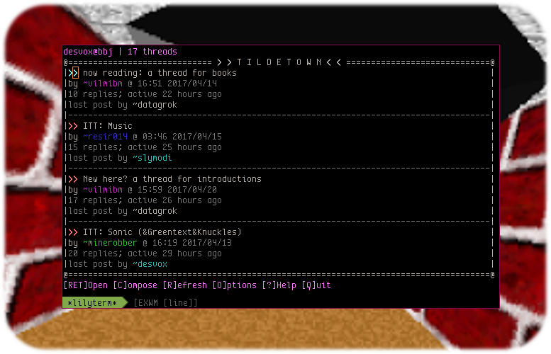

# Bulletin Butter & Jelly

BBJ is a trivial collection of python scripts and database queries that
create a fully functional, text-driven community bulletin board.
Requires Python 3.4 and up for the server and the official TUI client (clients/urwid/).

<h2>it boots!</h2>

It's all driven by an API sitting on top of CherryPy. Currently it does not
serve HTML but this is planned for the (distant?) future.

The two official client implementations are a stand alone TUI client for
the unix terminal, and GNU Emacs. The API is simple and others are welcome
to join the party at some point.
